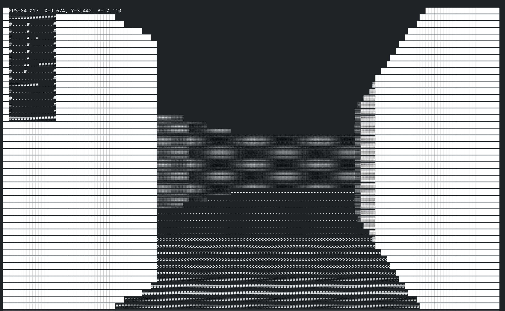

# Terminal FPS

Experimenting with rendering 3D graphics in the terminal. This started as a "paint-by-numbers" project, 
more or less as a direct port of [@OneLoneCoder's](https://github.com/OneLoneCoder/CommandLineFPS) 
command-line FPS engine into Rust. This is a work in progress.

Project goals:
* Learn a bit about 3D graphics
* Play around with Rust

## Usage

* `cargo run` to run the program.
* arrow keys to move around, q to quit

## Screenshots:

